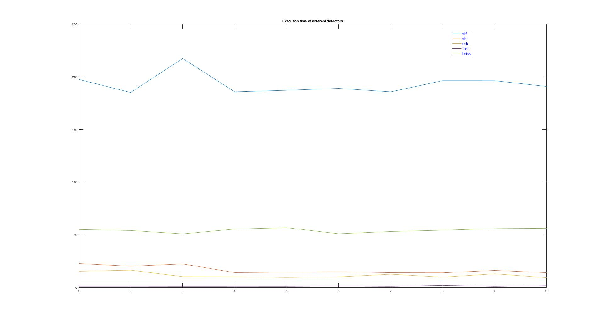

# SFND 2D Feature Tracking

#Task 1 Data Buffer Optimization
Ring buffer was implemented as std::deque.

#Task 2 Keypoint Detection
Harris detector implemented with non-maximum suppression. Other detectors implemented in plain open-cv.

#Task 3 Keypoint Removal
Keypoint outside of Rect are erased from vector.

#Task 4 Keypoint Descriptors
BRIEF, ORB, FREAK, AKAZE and SIFT descriptors are implemented.

#Task 5 Descriptor Matching
FLANN matching and k-nearest neighbor selection are impplemented.

#Task 6 Descriptor Distance Ratio
Descriptor distance ratio test is implemented.

#Task 7 : count the number of keypoints on the preceding vehicle for all 10 images
|            | # of Keypoints | Time(ms) |
|------------|----------------|----------|
| Shi-Tomasi | 1370           | 22.7936  |
| Shi-Tomasi | 1301           | 20.2346  |
| Shi-Tomasi | 1361           | 22.4203  |
| Shi-Tomasi | 1358           | 14.1898  |
| Shi-Tomasi | 1333           | 14.5625  |
| Shi-Tomasi | 1284           | 14.9884  |
| Shi-Tomasi | 1322           | 14.1135  |
| Shi-Tomasi | 1366           | 13.9777  |
| Shi-Tomasi | 1389           | 16.2458  |
| Shi-Tomasi | 1339           | 14.1036  |
| Harris     | 492            | 17.418   |
| Harris     | 502            | 10.78    |
| Harris     | 516            | 9.62     |
| Harris     | 524            | 9.38     |
| Harris     | 523            | 9.148    |
| Harris     | 511            | 8.84731  |
| Harris     | 505            | 9.24443  |
| Harris     | 510            | 8.9      |
| Harris     | 529            | 8.87     |
| Harris     | 520            | 8.98     |
| FAST       | 5063           | 2.04     |
| FAST       | 4952           | 1.87     |
| FAST       | 4863           | 1.77     |
| FAST       | 4840           | 2.1      |
| FAST       | 4856           | 2.54     |
| FAST       | 4899           | 1.88     |
| FAST       | 4870           | 2.05     |
| FAST       | 4868           | 1.96     |
| FAST       | 4996           | 2.20043  |
| FAST       | 4997           | 2.08     |
| BRISK      | 2757           | 221.136  |
| BRISK      | 2777           | 54.1485  |
| BRISK      | 2741           | 207.591  |
| BRISK      | 2735           | 188.451  |
| BRISK      | 2757           | 224.268  |
| BRISK      | 2695           | 200.064  |
| BRISK      | 2715           | 226.476  |
| BRISK      | 2628           | 194.14   |
| BRISK      | 2639           | 222.679  |
| BRISK      | 2672           | 200.075  |
| ORB        | 500            | 63.2809  |
| ORB        | 500            | 8.89947  |
| ORB        | 500            | 6.37402  |
| ORB        | 500            | 7.93502  |
| ORB        | 500            | 9.52496  |
| ORB        | 500            | 7.64688  |
| ORB        | 500            | 10.5457  |
| ORB        | 500            | 9.83195  |
| ORB        | 500            | 8.10326  |
| ORB        | 500            | 9.30359  |
| AKAZE      | 1351           | 104.222  |
| AKAZE      | 1327           | 103.469  |
| AKAZE      | 1311           | 91.5333  |
| AKAZE      | 1351           | 92.0802  |
| AKAZE      | 1360           | 114.41   |
| AKAZE      | 1347           | 104.118  |
| AKAZE      | 1363           | 90.8064  |
| AKAZE      | 1331           | 89.8814  |
| AKAZE      | 1357           | 89.0438  |
| AKAZE      | 1331           | 98.3149  |
| SIFT       | 1437           | 178.293  |
| SIFT       | 1371           | 140.156  |
| SIFT       | 1380           | 192.854  |
| SIFT       | 1335           | 160.832  |
| SIFT       | 1303           | 156.665  |
| SIFT       | 1369           | 174.759  |
| SIFT       | 1396           | 158.889  |
| SIFT       | 1382           | 156.456  |
| SIFT       | 1463           | 160.257  |
| SIFT       | 1422           | 137.299  |

#Task 8 : number of matched keypoints for all 10 images using all possible combinations of detectors and descriptors. 

| Descriptors combination | Match Count |
|-------------------------|-------------|
| BRISK-BRIEF:            | 1704        |
| BRISK-BRISK             | 1570        |
| BRISK-FREAK             | 1524        |
| BRISK-ORB               | 1514        |
| AKAZE-BRIEF:            | 1266        |
| AKAZE-AKAZE:            | 1259        |
| AKAZE-BRISK:            | 1215        |
| AKAZE-FREAK             | 1187        |
| AKAZE-ORB               | 1182        |
| FAST-BRIEF              | 1099        |
| FAST-ORB                | 1071        |
| SHITOMASI-BRIEF         | 944         |
| SHITOMASI-ORB           | 908         |
| FAST-BRISK              | 899         |
| FAST-FREAK              | 878         |
| SHITOMASI-FREAK         | 768         |
| SHITOMASI-BRISK         | 767         |
| ORB-ORB                 | 763         |
| ORB-BRISK               | 751         |
| SIFT-BRIEF              | 702         |
| SIFT-FREAK              | 593         |
| SIFT-BRISK              | 592         |
| ORB-BRIEF               | 545         |
| ORB-FREAK               | 420         |
| HARRIS-ORB              | 146         |
| HARRIS-BRIEF            | 146         |
| HARRIS-BRISK            | 129         |
| HARRIS-FREAK            | 128         |

#Task 9 : time it takes for keypoint detection and descriptor extraction
| Descriptors combination | Time       |
|-------------------------|------------|
| FAST-BRIEF:             | 0.00339893 |
| FAST-ORB:               | 0.00499745 |
| ORB-BRIEF:              | 0.0120047  |
| HARRIS-BRIEF:           | 0.017496   |
| HARRIS-ORB:             | 0.0202878  |
| ORB-ORB:                | 0.0209242  |
| SHITOMASI-BRIEF:        | 0.0240825  |
| SHITOMASI-ORB:          | 0.0261126  |
| FAST-FREAK:             | 0.0606877  |
| ORB-FREAK:              | 0.0670334  |
| HARRIS-FREAK:           | 0.074067   |
| SHITOMASI-FREAK:        | 0.0745609  |
| AKAZE-BRIEF:            | 0.110748   |
| AKAZE-ORB:              | 0.119912   |
| AKAZE-FREAK:            | 0.166581   |
| SIFT-BRIEF:             | 0.19373    |
| AKAZE-AKAZE:            | 0.201497   |
| SIFT-FREAK:             | 0.246861   |
| FAST-BRISK:             | 0.455582   |
| ORB-BRISK:              | 0.46206    |
| HARRIS-BRISK:           | 0.468443   |
| SHITOMASI-BRISK:        | 0.48087    |
| BRISK-BRIEF:            | 0.503373   |
| BRISK-ORB:              | 0.509693   |
| BRISK-FREAK:            | 0.559509   |
| AKAZE-BRISK:            | 0.564802   |
| SIFT-BRISK:             | 0.61479    |
| BRISK-BRISK:            | 0.955101   |

Top 3 combinations are FAST-BRIEF, FAST-ORB, ORB-BRIEF.

See the classroom instruction and code comments for more details on each of these parts. Once you are finished with this project, the keypoint matching part will be set up and you can proceed to the next lesson, where the focus is on integrating Lidar points and on object detection using deep-learning. 

## Dependencies for Running Locally
* cmake >= 2.8
  * All OSes: [click here for installation instructions](https://cmake.org/install/)
* make >= 4.1 (Linux, Mac), 3.81 (Windows)
  * Linux: make is installed by default on most Linux distros
  * Mac: [install Xcode command line tools to get make](https://developer.apple.com/xcode/features/)
  * Windows: [Click here for installation instructions](http://gnuwin32.sourceforge.net/packages/make.htm)
* OpenCV >= 4.1
  * This must be compiled from source using the `-D OPENCV_ENABLE_NONFREE=ON` cmake flag for testing the SIFT and SURF detectors.
  * The OpenCV 4.1.0 source code can be found [here](https://github.com/opencv/opencv/tree/4.1.0)
* gcc/g++ >= 5.4
  * Linux: gcc / g++ is installed by default on most Linux distros
  * Mac: same deal as make - [install Xcode command line tools](https://developer.apple.com/xcode/features/)
  * Windows: recommend using [MinGW](http://www.mingw.org/)

## Basic Build Instructions

1. Clone this repo.
2. Make a build directory in the top level directory: `mkdir build && cd build`
3. Compile: `cmake .. && make`
4. Run it: `./2D_feature_tracking`.
